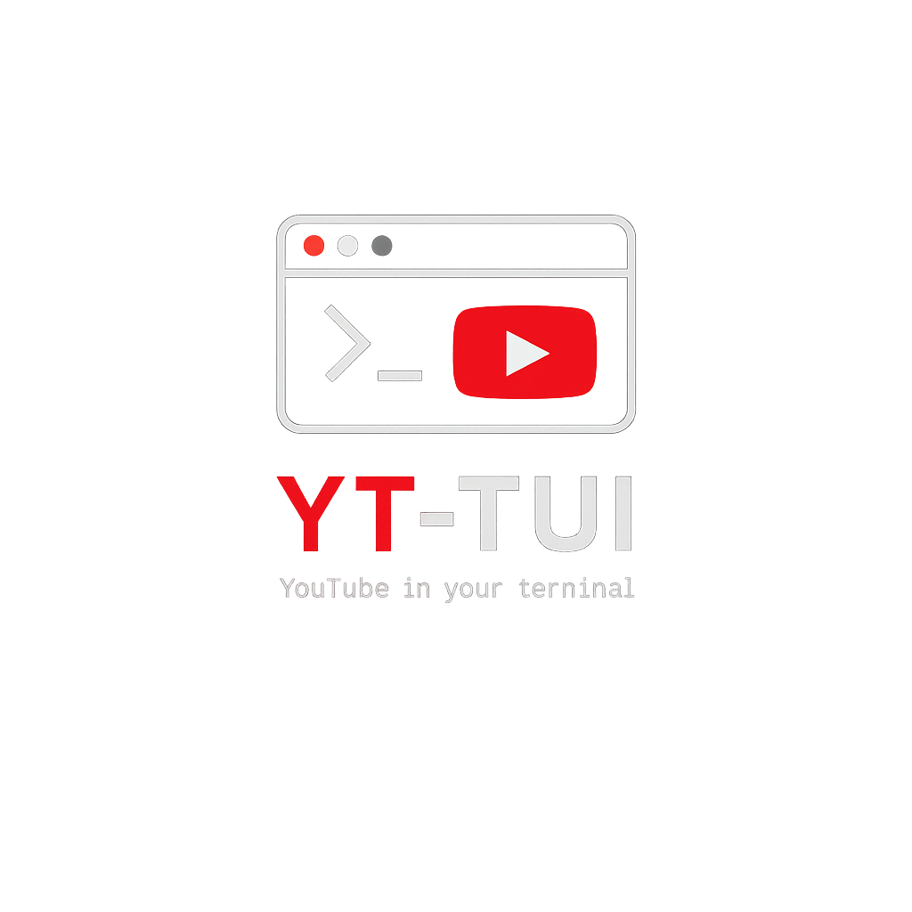

<p align="center">
  
</p>

<h1 align="center">YT-TUI</h1>

<p align="center">
  <strong>A lightweight, terminal-native YouTube client</strong><br/>
  Search, preview, and stream videos — no API key required, no browser needed.
</p>

<p align="center">
  <a href="https://github.com/Yashwanth-Kumar-26/yt-tui"></a>
  <a href="https://github.com/Yashwanth-Kumar-26/yt-tui"></a>
  <a href="https://github.com/Yashwanth-Kumar-26/yt-tui"></a>
  <a href="https://github.com/Yashwanth-Kumar-26/yt-tui"></a>
</p>

---

## Features

- **Universal Search** — keywords or direct YouTube video/playlist URLs
- **Side Navigation** — switch between Search and History views
- **Persistent History** — searches and watch history saved across sessions
- **Playlist Support** — auto-extract and list all videos from playlist links
- **Playback Options** — Video or Audio-only mode per session
- **Autoplay** — auto-advance through playlist tracks
- **Incognito Mode** — run without saving search or watch history
- **Asynchronous Thumbnails** — high-performance ANSI-art previews, non-blocking

## Requirements

- **Python 3.10+**
- **[mpv](https://mpv.io/)** — video & audio playback
- **[chafa](https://hpjansson.org/chafa/)** — thumbnail rendering (optional — thumbnails silently skip if missing)

### Install System Dependencies

```bash
# Fedora
sudo dnf install mpv chafa

# Ubuntu / Debian
sudo apt install mpv chafa

# Arch
sudo pacman -S mpv chafa

# macOS (Homebrew)
brew install mpv chafa

# Windows (Scoop)
scoop install mpv chafa

# Windows (Winget)
winget install shinchiro.mpv chafa
```

## Installation

YT-TUI uses [uv](https://docs.astral.sh/uv/) (a fast Python package manager) to install itself as a **global tool** — works from any directory, no virtual environment activation needed.

### Unix/Linux/macOS

```bash
git clone https://github.com/Yashwanth-Kumar-26/yt-tui.git
cd yt-tui
chmod +x setup.sh
./setup.sh
```

### Windows

```cmd
git clone https://github.com/Yashwanth-Kumar-26/yt-tui.git
cd yt-tui
setup.cmd
```

### Manual Install (any OS)

If you already have `uv` installed:

```bash
cd yt-tui
uv tool install .
```

> **Note:** The setup scripts automatically install `uv` if missing, resolve Python 3.10+, and install `yt-tui` as a global command.

## Usage

```bash
# Normal mode — history is saved
yt-tui

# Incognito mode — no search/watch history saved
yt-tui incog
```

The TUI launches with the search bar focused. Type a keyword or paste a YouTube URL and press **Enter**.

### Playback Flow

1. Search results appear as a table
2. Navigate with `↑` / `↓` — thumbnail preview updates live
3. Press **Enter** on a video
4. Choose **Video** or **Audio** mode
5. mpv launches for playback
6. Press `q` inside mpv to return to YT-TUI

If autoplay is ON (toggle with `a`), the next video starts automatically when the current one ends.

## Keyboard Reference

| Key | Action |
|-----|--------|
| `F1` | Toggle help screen |
| `/` | Focus search bar |
| `s` | Switch to Search tab |
| `h` | Switch to History tab |
| `a` | Toggle Autoplay (ON / OFF) |
| `↑` / `↓` | Navigate results |
| `Enter` | Choose play mode and play selected video |
| `Ctrl+Q` | Quit |

### mpv Playback Controls

| Key | Action |
|-----|--------|
| `Space` | Pause / resume |
| `←` / `→` | Seek backward / forward |
| `↑` / `↓` | Volume up / down |
| `q` | Stop playback and return to YT-TUI |

## Running Tests

```bash
cd yt-tui
pip install pytest
pytest tests/ -v
```

Or via `uv`:
```bash
cd yt-tui
uv run -- pytest tests/ -v
```

## Acknowledgement

YT-TUI is built on top of the incredible [yt-dlp](https://github.com/yt-dlp/yt-dlp) project. Massive thanks to the yt-dlp maintainers and community for keeping YouTube accessible and open.

## Notes

- Uses `yt-dlp` for YouTube access — **no API key needed**
- All user data stored in `~/.yt-tui/` as flat JSON
- **Cross-Platform**: tested on Linux, Windows, and macOS
- **Thumbnails**: require a terminal with Unicode/ANSI support (Windows Terminal, iTerm2, modern Linux terminal). Silently disabled if `chafa` is not installed
- **Audio Mode**: mpv runs with `--no-video` to save bandwidth
- **Incognito Mode**: `yt-tui incog` skips all history writes for the session
